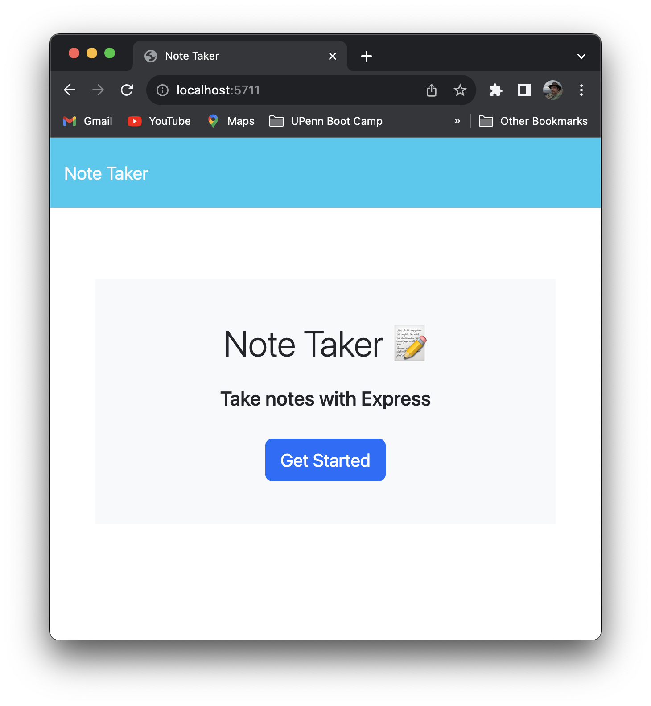
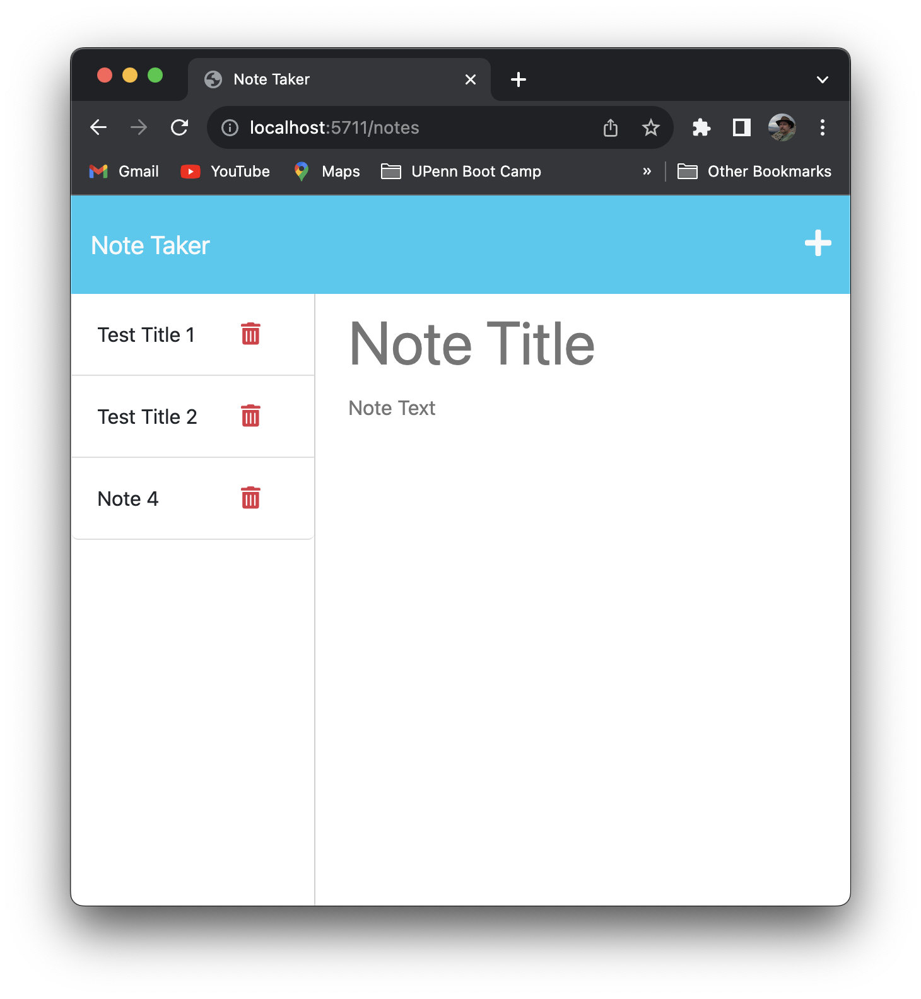

# Note Taker Web App

## Description

A NodeJS application which enables adding, deleting and editing of notes via a web interface with storage of those notes being persisted on a web server.

- Key features of the application are:
    - Use of express.js for interception of HTTP
    requests from the client/browser
    - Use of nodeJS for server-side processing

## Table of Contents

- [Usage](#usage)
- [Credits](#credits)
- [License](#license)

## Installation

1. Install NodeJS if it is not already installed.
2. from the [note-taker-tool repository of GitHub](https://github.com/stevreut/note-taker-tool):
    - select the green "**<> Code**" button
    - select the "**Download ZIP**" button from the resulting pop-up dialog
3. Placed the resulting `note-taker-tool-main.zip` file in the location of your choice.
4. Unpack the `note-taker-tool-main.zip` file, which should resulting in a folder/directory with name `note-taker-tool-main`:
    - on Mac: double-click
    - on Windows: right-click and [follow these instructions](https://support.microsoft.com/en-us/windows/zip-and-unzip-files-f6dde0a7-0fec-8294-e1d3-703ed85e7ebc)
5. Place the resulting files (except for this README.md and the screens/ folder and its contents) in a new directory.
6. Using bash, Mac terminal, or equivalent utility:
    - `cd` to the resulting `note-taker-tool-main` directory
    - `npm install` (to install "jest" and "inquirer") 
7. Initialize a new git repository in that new directory.
8. Deploy to a suitable web server.

## Usage

1. Access via URL on web browser.
2. Click on any of the notes on the side bar to
view a given note in full.
3. Click the '+' icon to start begin adding a new note, then type in title and content, then press the
save (diskette) icon to save the new note.  The note will then appear on the side bar and will also have been saved on the server at that point.
4. To delete a note, just click the trash can icon
next to the file to be deleted.  This deletion will
be reflected both in the sidebar and on the server.

Following are samples of the appearance of the app in various phases of processing:

## Credits

Special thanks to the teaching staff of the University of Pennsylvania Full Stack Coding Boot Camp (UPENN-VIRT-FSF-FT-07-2023-U-LOLC-M-F).

- [MDN Web Docs](https://developer.mozilla.org/en-US/)
- [NodeJS Documentation](https://nodejs.dev/en/api/v20/documentation/)

## License

As of this date (24 August 2023), no licensing policy has been established for this project or its repository.
